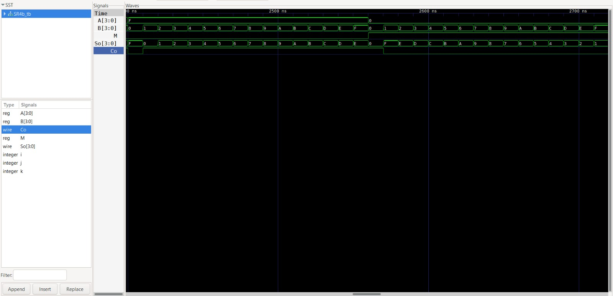

# Lab02 - Sumador/Restador de 4 bits

# Integrantes
* Juan Daniel Caballero Abril
* Andres Felipe Albarracin Diaz
* Kevin Steven Guzman Samper
  
# Informe

Indice:

1. [Documentación](#documentación-de-los-circuitos-implementados-implementado)
2. [Simulaciones](#simulaciones)
3. [Conclusiones](#conclusiones)
4. [Referencias](#referencias)

## Documentación del diseño implementado

### 1. Sumador/Restador

#### 1.1 Descripción

El diseño se fundamenta en la propiedad aritmética que establece que la resta $A - B$ es equivalente a sumar el complemento a 2 del sustraendo. Es decir: $A - B = A + (\sim B + 1)$.

Para implementar esto sin diseñar un restador desde cero, se introdujo una señal de control `M` (Modo) que determina la operación:
* **Modo Suma (M = 0):** El vector `B` pasa inalterado por las compuertas XOR. El acarreo de entrada ($Ci$) recibe un 0. El circuito realiza $A + B$.
* **Modo Resta (M = 1):** Las compuertas XOR invierten cada bit del vector `B` (complemento a 1). Como la señal `M` también está conectada directamente al pin de acarreo inicial ($Ci$) del sumador, se suma un 1 al resultado, obteniendo el complemento a 2. El circuito realiza $A - B$.

#### 1.2 Diagramas

En la vista RTL generada, se observa claramente la estructura del código implementado en `Sumador_Restador.v`. El vector de entrada `B[3..0]` atraviesa un banco de 4 compuertas XOR controladas en paralelo por la señal `M`, generando la señal interna `B_mod`. Este nuevo vector, junto con la entrada `A[3..0]`, alimenta al módulo instanciado `sumador_4b`. Destaca la conexión directa de la señal de control `M` al puerto `Ci` del sumador, lo cual es la clave para completar el complemento a 2.

## Simulaciones 

### 1. Simulación del sumador/restador

#### 1.1 Descripción

En la captura de GTKWave se puede analizar la respuesta del circuito:
* Las señales `A` y `B` varían en el tiempo mostrando diferentes combinaciones en hexadecimal.
* En la primera mitad de la simulación (`M = 0`), la salida `So` corresponde a la suma aritmética directa de las entradas.
* En la segunda mitad, la señal `M` pasa a nivel alto (1), activando la resta. Aquí, el bit de acarreo de salida (`Co`) se vuelve fundamental para interpretar el resultado: si `Co = 1`, el resultado de la resta es positivo. Si `Co = 0`, el resultado es negativo y está representado en complemento a 2.

#### 1.2 Diagrama

## Conclusiones

1. **Eficiencia en hardware:** La instanciación de módulos previos (como el sumador de 4 bits) y la adición de lógica combinacional simple (compuertas XOR) reduce drásticamente el tiempo de desarrollo y la cantidad de recursos necesarios en comparación con el diseño de un circuito restador dedicado.
2. **Implementación del complemento a 2:** Aprovechar el acarreo de entrada ($Ci$) de un sumador completo para inyectar la señal de control del modo de operación demuestra ser una técnica altamente eficiente para sumar el bit necesario tras aplicar el complemento a 1, unificando suma y resta en un solo bloque.
3. **Validación exhaustiva:** El uso de estructuras iterativas (`for`) dentro del *testbench* resulta indispensable en el diseño digital. Simular las 512 combinaciones posibles permite detectar errores de desbordamiento o problemas de lógica combinacional antes de realizar la síntesis y la carga física en la FPGA.

## Referencias

* Mano, M. M., & Ciletti, M. D. (2018). *Digital Design: With an Introduction to the Verilog HDL, VHDL, and SystemVerilog* (6th ed.). Pearson.
* Brown, S., & Vranesic, Z. (2014). *Fundamentals of Digital Logic with Verilog Design* (3rd ed.). McGraw-Hill Education.
